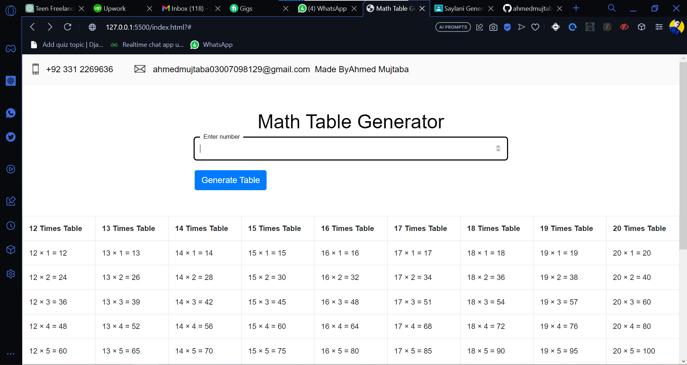

# Math Table Generator

## Table of Contents

- [Introduction](#introduction)
- [Features](#features)
- [Technologies Used](#technologies-used)
- [How to Use](#how-to-use)
- [Demo](#demo)

## Introduction

Math Table Generator is a web application that allows users to generate times tables for any number they enter. Whether you're a student, teacher, or just need quick access to times tables for basic math operations, this tool has got you covered!

## Features

- Simple and intuitive user interface
- Responsive design for a seamless experience across devices
- Dynamically generates times tables from the user's input number to 20
- Table format with rows representing multiplication results from 1 to 12
- Easy-to-read and well-organized display

## Technologies Used

The application is built using the following technologies:

- HTML
- CSS (Bootstrap)
- JavaScript (DOM manipulation)

## How to Use

1. Enter a number in the input field.
2. Click the "Generate Table" button.
3. The times table for the entered number will be displayed in a table format.

## Demo

You can try out the Math Table Generator by visiting the live demo [here](https://warm-wisp-ef08eb.netlify.app/).

